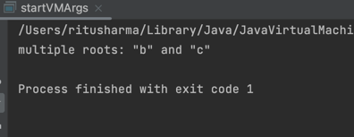
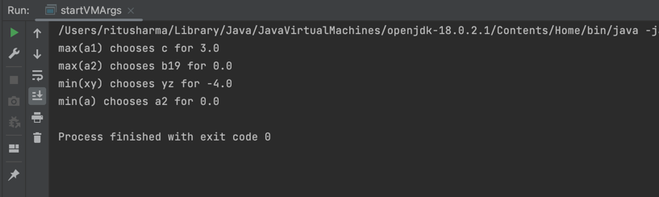

# **Readme** 

This project is for demonstrating minmax and alpha beta pruning in artificial intelligence. 

Few things about this project - 
1. inputFile.txt, shows the sample test case. Please give input in that format only and input file should be in the root directory of the project.
2. The execution arguments can be :  [-v] [-ab] [min/max] [inputFile.txt]  
        2.1. [-v] : Is verbose mode i.e. you'll get proper output with sentences  
        2.2. [-ab] : To apply alpha beta pruning  
        2.3. [min/max] : Is your player max or min  
3. This can also show any error in your inputFile i.e Multiple roots, no roots or cyclic graph (with showing which nodes)

Attaching few snapshots of output   
Sample 1    
    
Sample 2    

   

To execute the project do run the following commands in the project root directory :

1. mvn clean install
2. java -jar target/AILab-1.0-SNAPSHOT.jar [-v] [-ab] min/max inputFile.txt

If you find any discrepancy contact me on - rs8375@nyu.edu